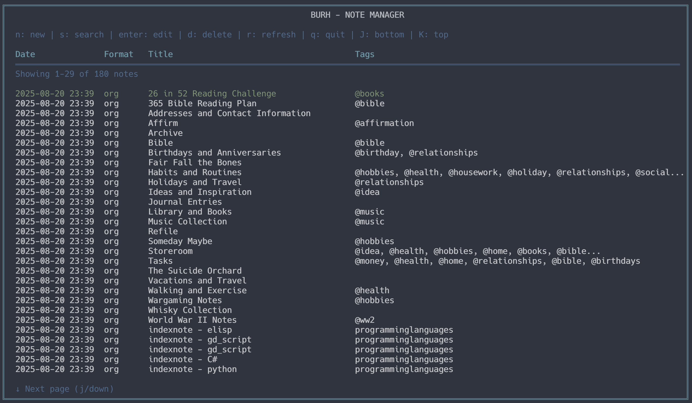

# Burh - Note Manager

<table>
<tr>
<td width="200">
  
</td>
<td>

Burh is a simple note-management tool inspired by [Denote](https://github.com/protesilaos/denote), written in Go. It provides both CLI and TUI interfaces for creating, managing, and searching notes with a predictable file-naming scheme.

*Note: "Burh" is the Old English word for a fortified settlement or stronghold - seemed a good name for a tool that helps secure and organize your knowledge. It is pronounced [burˠx], with a distinctive "kh" sound at the end. This sound is similar to the "ch" in the Scottish word "loch" or the "ch" in the German word "Burg".*

*Caveat: This program was created by a novice coder learning the ways of Go, so the code may not be as clean as it should be. It's alpha software for now. Beware of dragons! 🐉*

</td>
</tr>
</table>

## What does it look like?



*Screenshot showing the Burh Terminal User Interface with the Nord theme, displaying notes in a table format with columns for Date, Format, Title, and Tags.*

## Features

- **Unique Note IDs**: Each note gets a unique ID based on timestamp and title
- **Multiple Formats**: Support for `.org` (Org mode), `.txt` (plain text), and `.md` (Markdown) formats
- **Multiple Directories**: Support for multiple notes directories to organize notes across different locations
- **CLI Interface**: Full command-line interface for scripting and automation
- **TUI Interface**: Interactive terminal user interface for easy note management
- **Search Functionality**: Search notes by title, content, tags, or date
- **Configurable**: Customizable colors and notes directory locations
- **Nord Theme**: Beautiful default Nord color palette
- **Tagging System**: Organize notes with tags
- **CRUD Operations**: Create, Read, Update, and Delete notes

## Installation

### Prerequisites

- Go 1.21 or later

### Windows Installation

#### Option 1: Build from Source (Recommended)

1. **Install Go**: Download and install Go from [golang.org](https://golang.org/dl/)
2. **Clone the repository**:
   ```cmd
   git clone <repository-url>
   cd burh
   ```
3. **Build the application**:
   ```cmd
   go mod tidy
   go build -o burh.exe
   ```
4. **Add to PATH** (optional): Copy `burh.exe` to a directory in your PATH, or add the current directory to your PATH

#### Option 2: Using Go Install

If you have Go installed, you can install directly:

```cmd
go install
```

The binary will be installed to `%GOPATH%/bin` (usually `%USERPROFILE%/go/bin`). Make sure this directory is in your PATH.

#### Option 3: Using Pre-built Release

1. **Download the latest release** from the [GitHub releases page](link-to-releases)
2. **Extract the ZIP file** to a folder of your choice
3. **Run the executable**:
   - Double-click `burh.exe` to run in TUI mode
   - Or open Command Prompt and run: `burh.exe`
4. **Add to PATH** (optional): Copy `burh.exe` to a directory in your PATH for global access

### macOS Installation

#### Option 1: Build from Source (Recommended)

1. **Install Go**: Download and install Go from [golang.org](https://golang.org/dl/) or use Homebrew:
   ```bash
   brew install go
   ```
2. **Clone the repository**:
   ```bash
   git clone <repository-url>
   cd burh
   ```
3. **Build the application**:
   ```bash
   go mod tidy
   go build -o burh
   ```
4. **Add to PATH** (optional): Copy `burh` to `/usr/local/bin` or add the current directory to your PATH

#### Option 2: Using Go Install

If you have Go installed, you can install directly:

```bash
go install
```

The binary will be installed to `$GOPATH/bin` (usually `$HOME/go/bin`). Make sure this directory is in your PATH.

#### Option 3: Using Pre-built Release

1. **Download the latest release** from the [GitHub releases page](link-to-releases)
2. **Extract the TAR.GZ file** to a folder of your choice
3. **Make it executable** (if needed):
   ```bash
   chmod +x burh
   ```
4. **Run the application**:
   ```bash
   ./burh
   ```
5. **Add to PATH** (optional): Copy `burh` to `/usr/local/bin` for global access:
   ```bash
   sudo cp burh /usr/local/bin/
   ```

### Build from Source (Other Platforms)

```bash
git clone <repository-url>
cd burh
go mod tidy
go build -o burh
```

## Configuration

Burh uses a configuration file located at `~/.burhrc.yaml`. The configuration file is created automatically on first run with default values.

### Configuration Options

```yaml
notes_dirs:
  - ~/notes
  - ~/work/notes
  - ~/personal/notes
theme:
  primary: "#88C0D0"    # Nord Blue
  secondary: "#4C566A"  # Nord Gray
  success: "#A3BE8C"    # Nord Green
  warning: "#EBCB8B"    # Nord Yellow
  error: "#BF616A"      # Nord Red
  info: "#81A1C1"       # Nord Light Blue
  muted: "#5E81AC"      # Nord Dark Blue
```

### Managing Notes Directories

You can manage your notes directories in several ways:

1. **During First Run**: When you first run Burh, you'll be prompted to set up your primary notes directory and optionally add additional directories.

2. **Manual Configuration**: Edit the `~/.burhrc.yaml` file directly to add or remove directories.

3. **CLI Commands**: Use the built-in commands to manage directories:
   - `burh list-dirs` - List all configured directories
   - `burh add-dir -p /path/to/directory` - Add a new directory
   - `burh remove-dir -p /path/to/directory` - Remove a directory

**Note**: At least one directory must remain in the configuration.

## Usage

### TUI Mode (Default)

Run burh without arguments to start the interactive TUI:

```bash
burh
```

**TUI Controls:**
- `n` - Create new note
- `s` - Search notes
- `enter` - Edit selected note
- `d` - Delete selected note
- `r` - Refresh note list
- `j/k` or `up/down` - Navigate notes
- `q` or `ctrl+c` - Quit

### CLI Commands

#### Create a Note

```bash
# Create a simple note
burh create -t "My Note Title" -c "Note content here"

# Create a note with tags
burh create -t "Meeting Notes" -c "Discussion points..." -g "work,meeting,important"

# Create an Org mode note
burh create -t "Project Ideas" -c "* Idea 1\n* Idea 2" -f org

# Create a Markdown note
burh create -t "Documentation" -c "# Heading\n\nSome content with **bold** text" -f md
```

#### List Notes

```bash
# List all notes
burh list

# List with tags
burh list -t

# List with content preview
burh list -c

# List with both tags and content
burh list -t -c
```

#### Search Notes

```bash
# Search by query
burh search "meeting"

# Search with content preview
burh search "project" -c
```

#### Manage Notes Directories

```bash
# List all configured directories
burh list-dirs

# Add a new directory
burh add-dir -p ~/work/notes

# Remove a directory
burh remove-dir -p ~/old/notes
```

#### Global Options

```bash
# Use custom config file
burh --config /path/to/burhrc.yaml
```

## File Naming Scheme

Notes are saved with a unique filename following this pattern:
```
YYYYMMDD_HHMMSS_sanitized_title.format
```

Examples:
- `20241201_143022_meeting_notes.txt`
- `20241201_143045_project_ideas.org`
- `20241201_143100_documentation.md`

## File Formats

### Plain Text (.txt)

```
Title: Meeting Notes
Created: 2024-12-01 14:30:22
Modified: 2024-12-01 14:30:22
Tags: work, meeting, important

Meeting content goes here...
```

### Org Mode (.org)

```
#+TITLE: Project Ideas
#+DATE: 2024-12-01
#+MODIFIED: 2024-12-01
#+TAGS: project ideas brainstorming

* Project Idea 1
  Description of the first idea

* Project Idea 2
  Description of the second idea
```

### Markdown (.md)

```
Title: Documentation
Created: 2024-12-01 14:31:00
Modified: 2024-12-01 14:31:00
Tags: documentation, guide, reference

# Main Heading

This is a **Markdown** note with *italic* text and `code` snippets.

## Subheading

- List item 1
- List item 2
- List item 3

### Code Block

```bash
echo "Hello, World!"
```
### Searching and Managing

```bash
# Find all work-related notes
burh search "work"

# Find notes from today
burh list | grep $(date +%Y-%m-%d)

# Find notes with specific tags
burh search "important"
```

## Development

### Project Structure

```
burh/
├── cmd/           # CLI commands
├── config/        # Configuration management
├── notes/         # Note management logic
├── tui/           # Terminal UI components
├── main.go        # Application entry point
├── go.mod         # Go module file
└── README.md      # This file

```

## Contributing

1. Fork the repository
2. Create a feature branch
3. Make your changes
4. Add tests if applicable
5. Submit a pull request

## License

This project is licensed under the GNU General Public License v3.0 (GPL-3.0) - see the LICENSE file for details.

## Acknowledgments

- Inspired by [Denote](https://github.com/protesilaos/denote) by Protesilaos Stavrou
- Built with [Cobra](https://github.com/spf13/cobra) for CLI
- TUI powered by [Bubble Tea](https://github.com/charmbracelet/bubbletea) and [Lip Gloss](https://github.com/charmbracelet/lipgloss)
